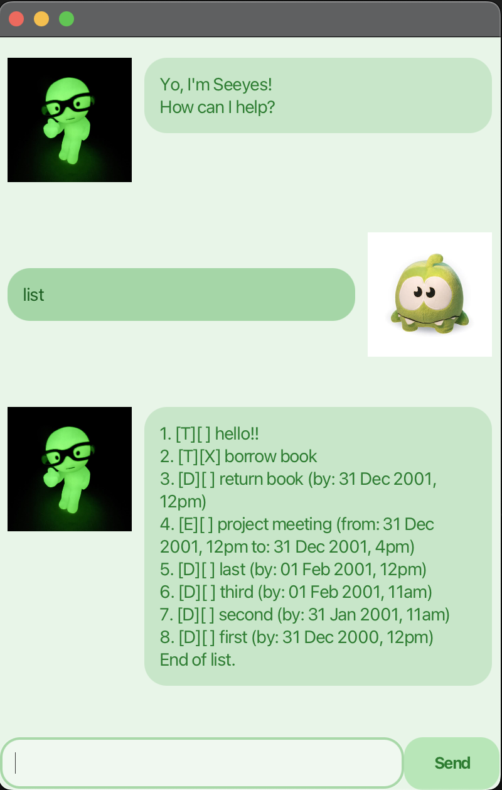

# Seeyes User Guide



# Intro

Seeyes is a JavaFX-based chatbot that helps you manage tasks and deadlines in a friendly and aesthetic chat interface.

# Adding Tasks

You can add deadlines to your task list using the following command:

| Command    | Description         | Example Usage                                              |
| ---------- | ------------------- | ---------------------------------------------------------- |
| `deadline` | Add a deadline task | `deadline return book /by 31 Dec 2001 1200`                |
| `event`    | Add an event task   | `event meeting /from 31 Dec 2001 1200 /to 31 Dec 2001 4pm` |
| `todo`     | Add a todo task     | `todo borrow book`                                         |

When you add a deadline, it will appear in your task list with its due date clearly shown.

Example: `deadline return book /by 31 Dec 2001, 12pm`

```
Added deadline: [D][ ] return book (by: 31 Dec 2001, 12pm)
Now you have 1 task in the list.
```

# Other Features

## Marking tasks

Show a list of your tasks by typing `list`
Then, mark a task as done with `mark <task number>`
type `list` again to see that it's marked!

## Sorting Deadlines

You can see a sorted list of your deadlines by typing `deadlines`

The app will show you a sorted list of your deadlines so you can see the more urgent tasks first.

## Feature:
